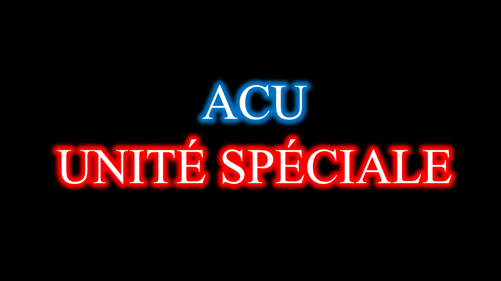
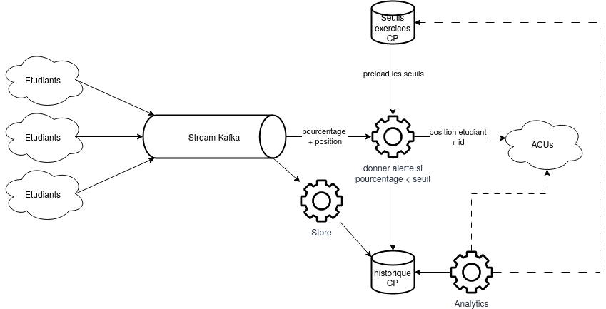

# Projet de Data Engineering: ACU Unité Spéciale

    

## Définition du contexte métier

La piscine de C est une épreuve phare de l'EPITA. Suite à son rayonnement et son succès, cette épreuve devient un examen national se déroulant sur l'ensemble du territoire français.

Les étudiants passant cet examen réalisent des exercices depuis leur ordinateur portable et transmettent leur réalisation à un service tier (nommé la moulinette). Une fois leurs résultats obtenus, les ordinateurs portables de ces étudiants émettent à nos services les données suivantes:
- La date d'envoi (nommée le timestamp)
- L'identifiant de l’étudiant
- Sa position géographique (sa latitude et longitude)
- L'identifiant de l'exercice
- Le résultat (en %) obtenu par l’étudiant sur l'exercice reference (nommée la métrique)

En fonction du pourcentage de réussite par l’étudiant, une patrouille spéciale d'Assistants C/UNIX (surnommés les ACUs) est déployée sur le site de l’échec (la position de l’étudiant) pour "corriger" l’étudiant et le remettre sur le **droit** chemin de la réussite scolaire.

## Description de l'architecture des services

Premièrement, notons les rôles suivants:
- Les producteurs: ce sont les ordinateurs portables transmettant les informations de l’étudiant à nos services.
- Les consommateurs: ce sont nos services de traitement des données des étudiants.

Les données émises par les ordinateurs portables sont dans un premier temps ingurgitées dans une **Stream Kafka**. Celle-ci se chargera de repartir et transmettre ces données à nos différents consommateurs.

Le traitement des données est pluriel et nécessite une haute vitesse d'exécution.
Il se découpe en trois grands services:
- Le premier service est un service d'alerte. Ce service doit être capable de rapidement notifier d'une alerte aux unités en patrouille (temps réel). L'alerte doit être "at least once." Cette contrainte business justifie l'utilisation d'une stream Kafka dans laquelle le service d'alerte va aller chercher la donnée a traiter.
	- Pour chaque donnée à traiter, le service contacte une base de donnée contenant les seuils d’échecs associées à chaque exercice. Cette base de donnée est mise à jour à chaque fois qu'un nouvel exercice est ajouté au programme de la Piscine. La base ne contenant qu'une relation entre l'id d'un exercice et son seuil d’échec à franchir pour éviter le déploiement d'une patrouille ACU, nous pouvons utiliser une base de donnée CP de type clef-valeur. La base doit être consistante pour que le moindre changement de seuil sur un exercice donné soit pris en compte par l'ensemble des instances d'alertes avant traitement de nouvelles données.
	- Une fois les seuils obtenus, le service cherche la donnée dans la stream, et lève une alerte pour un étudiant si son résultat à un exercice est en dessous du seuil paramétré.
	- Une fois l'alerte levée, une patrouille motorisée d'ACU est notifiée et déployée sur site. On stocke, dans une base de donnée à stockage longue durée, un rapport de déploiement d'une patrouille contenant l'id de l’étudiant, le résultat pour lequel il a levé une alerte, et l'id de l'exercice. 

- Un deuxième service se charge de transférer la donnée dans la base de donnée à stockage longue durée.
- Sur cette base de donnée, un service va régulièrement effectuer des analyses sur les scores obtenus pour en déduire les tendances suivantes:
	- Les positions géographiques comportant le plus grand nombre d’échecs sur un exercice donné.
	- Le taux de réussite des étudiants après *gratification* d'une intervention des ACUs
	- Le taux de réussite moyen sur chaque exercice de l'ensemble des étudiants.

Le système de stockage de donnée à long terme doit être résiliant aux partitions et doit rester consistante. La base de donnée n'est pas sujet à de nombreuses queries en lecture, mais l'est en écriture. Ainsi, une base de donnée CP est adaptée à notre contrainte business.

## L'architecture en image

    

## Contributeurs

Ce projet est mené par le groupe 6 de la promotion 2025 SCIA à l'EPITA.
Les membres du groupe sont les suivants:
- [Lilian Schall](https://github.com/LilianSchall) <lilian.schall@epita.fr> 
- [Guillaume Lalire](https://github.com/GuillaumeLalire) <guillaume.lalire@epita.fr>
- [Julien Schaffauser](https://github.com/JulienSchaff) <julien.schaffauser@epita.fr>
- [Emile Merle](https://github.com/Echidori) <emile.merle@epita.fr>
