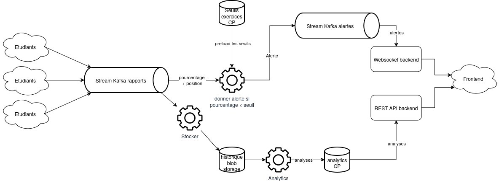

# Projet de Data Engineering: ACU Unité Spéciale

    

## Contributeurs

Ce projet est mené par le groupe 6 de la promotion 2025 SCIA a l'EPITA.
Les membres du groupe sont les suivants:
- [Lilian Schall](https://github.com/LilianSchall) <lilian.schall@epita.fr> 
- [Guillaume Lalire](https://github.com/GuillaumeLalire) <guillaume.lalire@epita.fr>
- [Julien Schaffauser](https://github.com/JulienSchaff) <julien.schaffauser@epita.fr>
- [Emile Merle](https://github.com/Echidori) <emile.merle@epita.fr>
